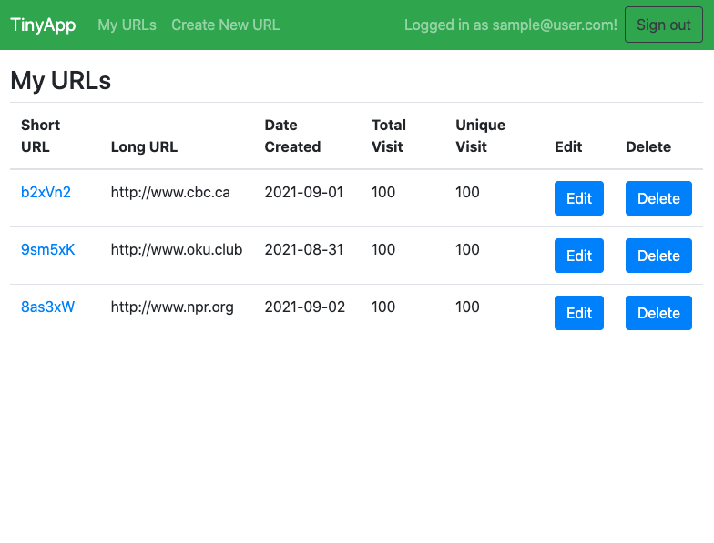
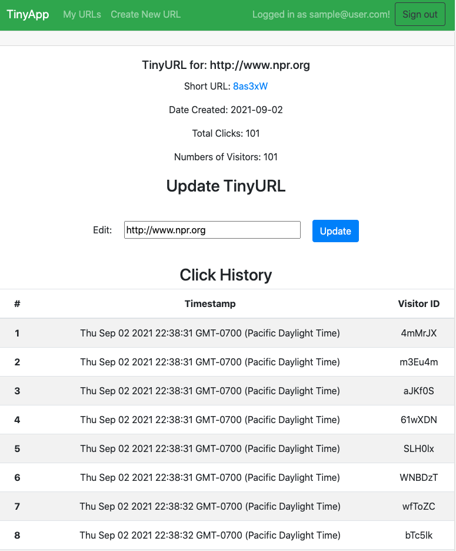

# Tiny App Project

- [About](#about)
- [Features](#features)
- [Final Product](#final-product)
- [Dependencies](#dependencies)
- [Install](#install)

## About

A 'full stack' web application built with Node and Express that allows users to shorten long URLs (à la bit.ly).

## Features

The application enables users to create and manage shortened URLs. A user must register and login to their account to create and edit URLs. View count, visitor history and other analytics are also available for every shortened URL.

### Security Features

- password hashing with SHA-256
- cookie encryption

## Final Product





## Dependencies

- Node.js
- Express
- EJS
- bcrypt.js
- body-parser
- cookie-session

## Install

Install dependencies.

```
npm install
```

Start the server.

```
npm start
```

The default port is 8080.

```
http://localhost:8080
```
